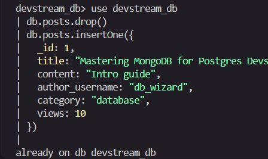
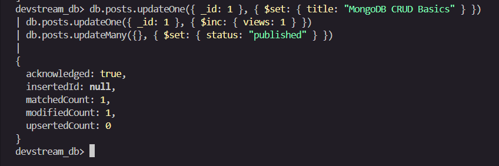

# Activity 10 Solution

## Part 1: Quick Mapping (Postgres -> MongoDB)

| PostgreSQL | MongoDB Equivalent |
|---|---|
| `INSERT INTO posts ...` | `db.posts.insertOne({ ... })` |
| `SELECT * FROM posts WHERE title='...'` | `db.posts.find({ title: '...' })` |
| `UPDATE posts SET title='...' WHERE id=...` | `db.posts.updateOne({ _id: ... }, { $set: { title: '...' } })` |
| `DELETE FROM posts WHERE id=...` | `db.posts.deleteOne({ _id: ... })` |

---

## Part 2: Hands-on CRUD in MongoDB

### 2.1 Setup

Commands:

```javascript
use devstream_db
db.posts.drop()

db.posts.insertOne({
  _id: 1,
  title: "Mastering MongoDB for Postgres Devs",
  content: "Intro guide",
  author_username: "db_wizard",
  category: "database",
  views: 10
})
```

Screenshot(s):


---

### 2.2 Create

Commands:

```javascript
db.posts.insertOne({
  _id: 2,
  title: "Getting Started with NoSQL Databases",
  content: "A beginner's guide to document-based storage",
  author_username: "code_explorer",
  category: "tutorial",
  views: 0
})
```

Screenshot(s):


---

### 2.3 Read

Commands:

```javascript
// 1. Find all posts
db.posts.find()

// 2. Find the post with _id: 1
db.posts.find({ _id: 1 })

// 3. Show only title and author_username (exclude _id)
db.posts.find({}, { _id: 0, title: 1, author_username: 1 })
```

Screenshot(s):


---

### 2.4 Update

Commands:

```javascript
// 1. Change the title of _id: 1 to "MongoDB CRUD Basics"
db.posts.updateOne(
  { _id: 1 },
  { $set: { title: "MongoDB CRUD Basics" } }
)

// 2. Increase views of _id: 1 by 1 using $inc
db.posts.updateOne(
  { _id: 1 },
  { $inc: { views: 1 } }
)

// 3. Add status: "published" to all posts
db.posts.updateMany(
  {},
  { $set: { status: "published" } }
)
```

Screenshot(s):


---

### 2.5 Delete

Commands:

```javascript
db.posts.deleteOne({ _id: 2 })
```

Screenshot(s):


---

## Part 3: Reflection (3-4 sentences)

1. **One thing that feels easier in MongoDB CRUD:**
   Inserting documents in MongoDB feels more natural and flexible because there is no need to define a schema or table structure beforehand. You can insert any shape of document directly, which speeds up prototyping and makes it easy to add new fields without running `ALTER TABLE` migrations.

2. **One thing that was clearer in PostgreSQL CRUD:**
   PostgreSQL's structured SQL syntax makes it very clear what data types and columns are expected, which reduces the chance of accidentally inserting malformed data. The strict schema enforcement in PostgreSQL acts as a built-in safety net, whereas MongoDB requires the developer to enforce data consistency at the application level.
