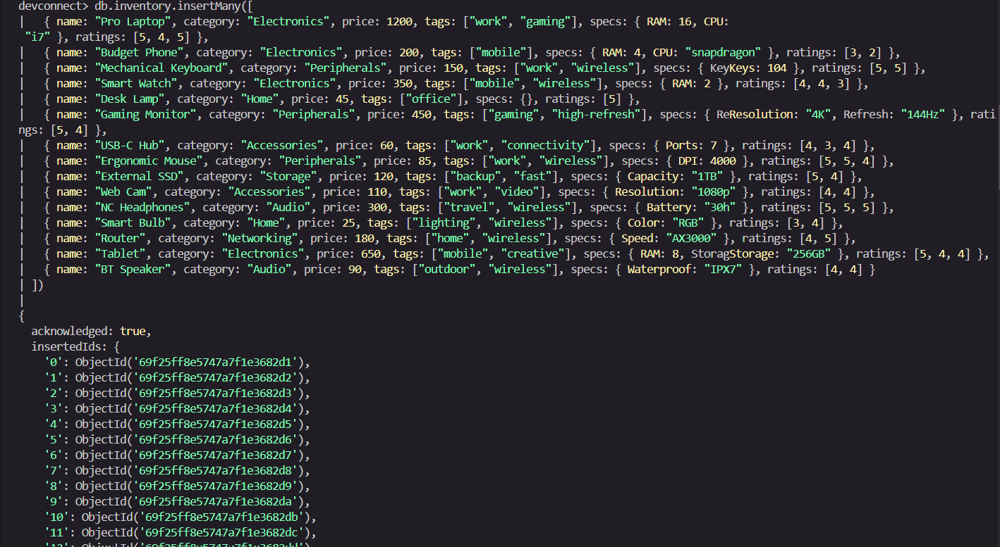
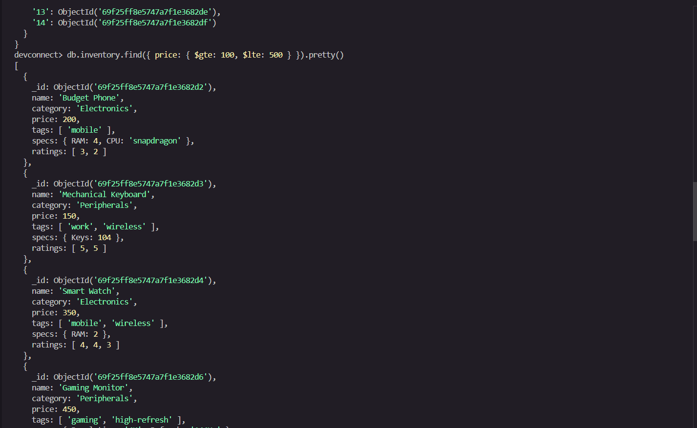
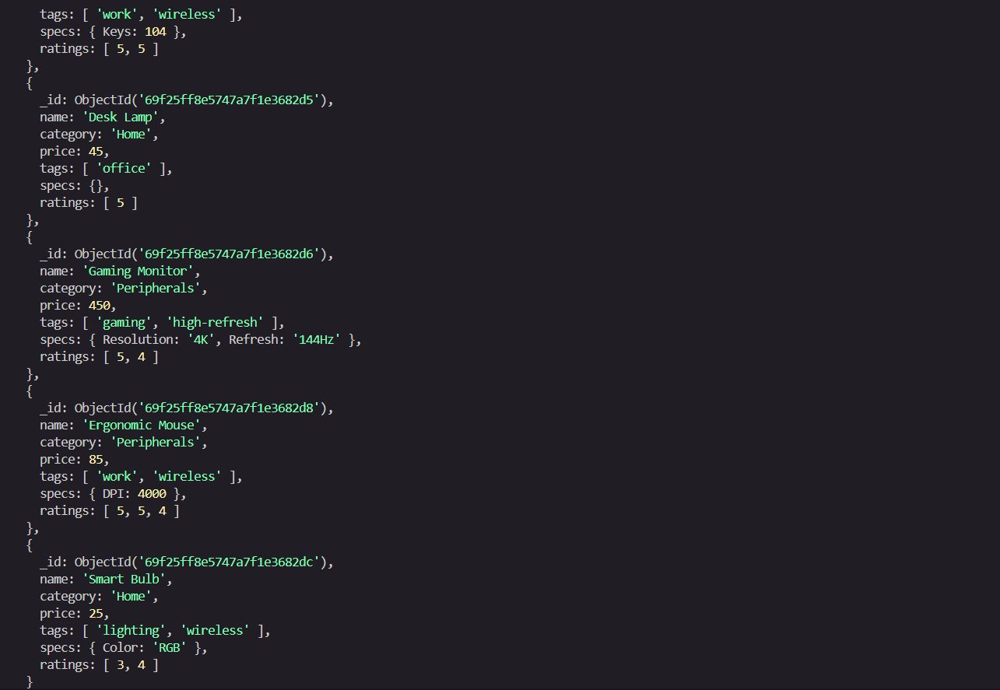
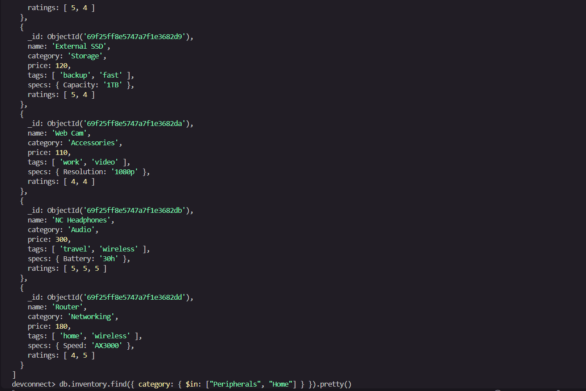
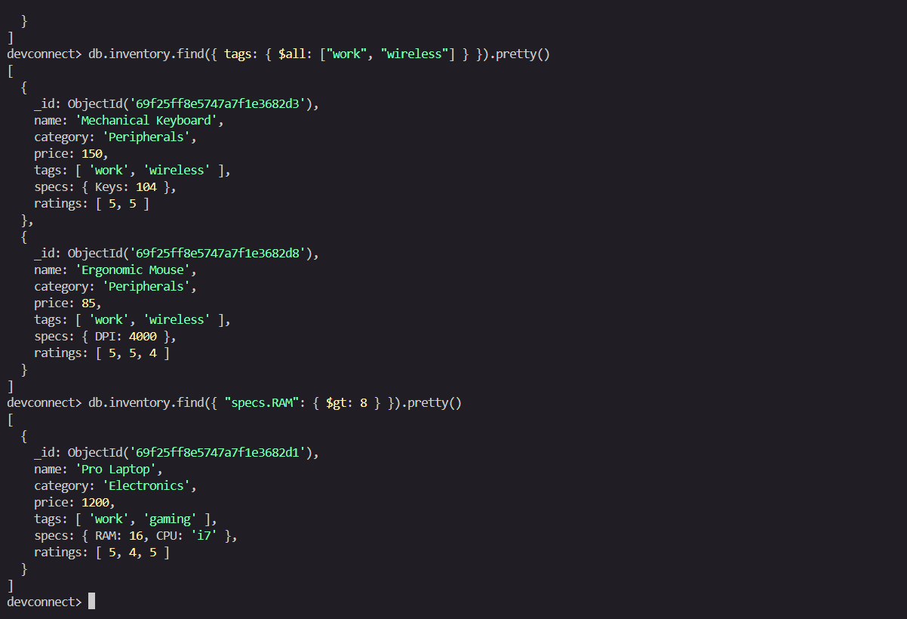

# Lab Activity 11: SQL to MongoDB & Advanced Querying
## Solution

---

## Part 1: Relational to Document Modeling

### 1. Proposed JSON Schema

```json
{
  "_id": ObjectId("64b1f2c3e4b0a1b2c3d4e5f6"),
  "title": "Getting Started with NoSQL Databases",
  "body": "NoSQL databases like MongoDB offer flexible schemas...",
  "created_at": ISODate("2026-04-29T10:00:00Z"),
  "author": {
    "_id": ObjectId("64b1f2c3e4b0a1b2c3d4e5a1"),
    "username": "jdoe",
    "email": "jdoe@devconnect.io"
  },
  "tags": [
    "nosql",
    "javascript",
    "mongodb"
  ]
}
```

---

### 2. Strategic Choices

| Field  | Decision  |
|--------|-----------|
| Tags   | **Embed** |
| Author | **Embed** (partial) |

---

### 3. Justification

**Tags** are embedded as a simple array of strings because they are small, bounded values that are always read together with the post. Embedding avoids the overhead of a separate lookup and eliminates the need for a junction table (like `post_tags`), making queries like "find all posts tagged 'javascript'" fast and straightforward with a single index on the `tags` field.

**Author** data is partially embedded (username and email only) because the most common read pattern — displaying a post — always needs the author's name alongside the content. Storing the full author document by reference (`author_id`) would require an extra round-trip on every post read. A partial embed of the stable, display-relevant fields (username, email) balances read performance against the risk of stale data; if a username changes, a background update can propagate it, which is an acceptable trade-off given how rarely usernames change.

---

## Part 2: Querying with MQL Operators

### Insert Script

```js
db.inventory.insertMany([
  {
    name: "Pro Laptop",
    category: "Electronics",
    price: 1200,
    tags: ["work", "gaming"],
    specs: { RAM: 16, CPU: "i7" },
    ratings: [5, 4, 5]
  },
  {
    name: "Budget Phone",
    category: "Electronics",
    price: 200,
    tags: ["mobile"],
    specs: { RAM: 4, CPU: "snapdragon" },
    ratings: [3, 2]
  },
  {
    name: "Mechanical Keyboard",
    category: "Peripherals",
    price: 150,
    tags: ["work", "wireless"],
    specs: { Keys: 104 },
    ratings: [5, 5]
  },
  {
    name: "Smart Watch",
    category: "Electronics",
    price: 350,
    tags: ["mobile", "wireless"],
    specs: { RAM: 2 },
    ratings: [4, 4, 3]
  },
  {
    name: "Desk Lamp",
    category: "Home",
    price: 45,
    tags: ["office"],
    specs: {},
    ratings: [5]
  },
  {
    name: "Gaming Monitor",
    category: "Peripherals",
    price: 450,
    tags: ["gaming", "high-refresh"],
    specs: { Resolution: "4K", Refresh: "144Hz" },
    ratings: [5, 4]
  },
  {
    name: "USB-C Hub",
    category: "Accessories",
    price: 60,
    tags: ["work", "connectivity"],
    specs: { Ports: 7 },
    ratings: [4, 3, 4]
  },
  {
    name: "Ergonomic Mouse",
    category: "Peripherals",
    price: 85,
    tags: ["work", "wireless"],
    specs: { DPI: 4000 },
    ratings: [5, 5, 4]
  },
  {
    name: "External SSD",
    category: "Storage",
    price: 120,
    tags: ["backup", "fast"],
    specs: { Capacity: "1TB" },
    ratings: [5, 4]
  },
  {
    name: "Web Cam",
    category: "Accessories",
    price: 110,
    tags: ["work", "video"],
    specs: { Resolution: "1080p" },
    ratings: [4, 4]
  },
  {
    name: "NC Headphones",
    category: "Audio",
    price: 300,
    tags: ["travel", "wireless"],
    specs: { Battery: "30h" },
    ratings: [5, 5, 5]
  },
  {
    name: "Smart Bulb",
    category: "Home",
    price: 25,
    tags: ["lighting", "wireless"],
    specs: { Color: "RGB" },
    ratings: [3, 4]
  },
  {
    name: "Router",
    category: "Networking",
    price: 180,
    tags: ["home", "wireless"],
    specs: { Speed: "AX3000" },
    ratings: [4, 5]
  },
  {
    name: "Tablet",
    category: "Electronics",
    price: 650,
    tags: ["mobile", "creative"],
    specs: { RAM: 8, Storage: "256GB" },
    ratings: [5, 4, 4]
  },
  {
    name: "BT Speaker",
    category: "Audio",
    price: 90,
    tags: ["outdoor", "wireless"],
    specs: { Waterproof: "IPX7" },
    ratings: [4, 4]
  }
]);
```

---

### Query 1 — Price Range
**Find all items priced between $100 and $500 (inclusive).**

```js
db.inventory.find({
  price: { $gte: 100, $lte: 500 }
})
```

**Expected matches:** Budget Phone (200), Mechanical Keyboard (150), Smart Watch (350), Gaming Monitor (450), External SSD (120), Web Cam (110), NC Headphones (300), Router (180), Tablet (650 — excluded), BT Speaker (90 — excluded)

---

### Query 2 — Category Match
**Find all items in either the "Peripherals" or "Home" categories.**

```js
db.inventory.find({
  category: { $in: ["Peripherals", "Home"] }
})
```

**Expected matches:** Mechanical Keyboard, Gaming Monitor, Ergonomic Mouse, Desk Lamp, Smart Bulb

---

### Query 3 — Tag Power
**Find all items that have BOTH the "work" AND "wireless" tags.**

```js
db.inventory.find({
  tags: { $all: ["work", "wireless"] }
})
```

**Expected matches:** Mechanical Keyboard, Ergonomic Mouse

---

### Query 4 — Nested Check
**Find all items where `specs.RAM` is greater than 8GB.**

```js
db.inventory.find({
  "specs.RAM": { $gt: 8 }
})
```

**Expected matches:** Pro Laptop (RAM: 16)

> **Note:** Field names in the dataset use uppercase `RAM`. The query uses `"specs.RAM"` to match the exact casing used during insert.

---

### Query 5 — High Ratings
**Find all items that have at least one `5` in their ratings array.**

```js
db.inventory.find({
  ratings: 5
})
```

> MongoDB's array equality check automatically matches documents where **any element** in the array equals the value, so no special operator is needed. Alternatively, `{ ratings: { $elemMatch: { $eq: 5 } } }` is equivalent and more explicit.

**Expected matches:** Pro Laptop, Mechanical Keyboard, Desk Lamp, Gaming Monitor, Ergonomic Mouse, External SSD, NC Headphones, Router, Tablet

---

## Screenshots

### Insert Data


### Query 1 — Price Range ($100–$500)


### Query 2 — Category Match (Peripherals or Home)


### Query 3 — Tag Power (work AND wireless)


### Query 4 — Nested Check (specs.RAM > 8)


### Query 5 — High Ratings (contains 5)

