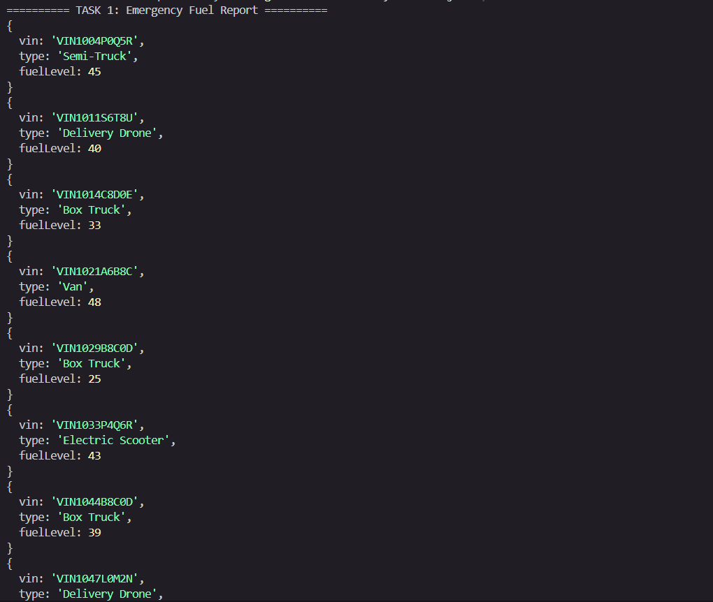
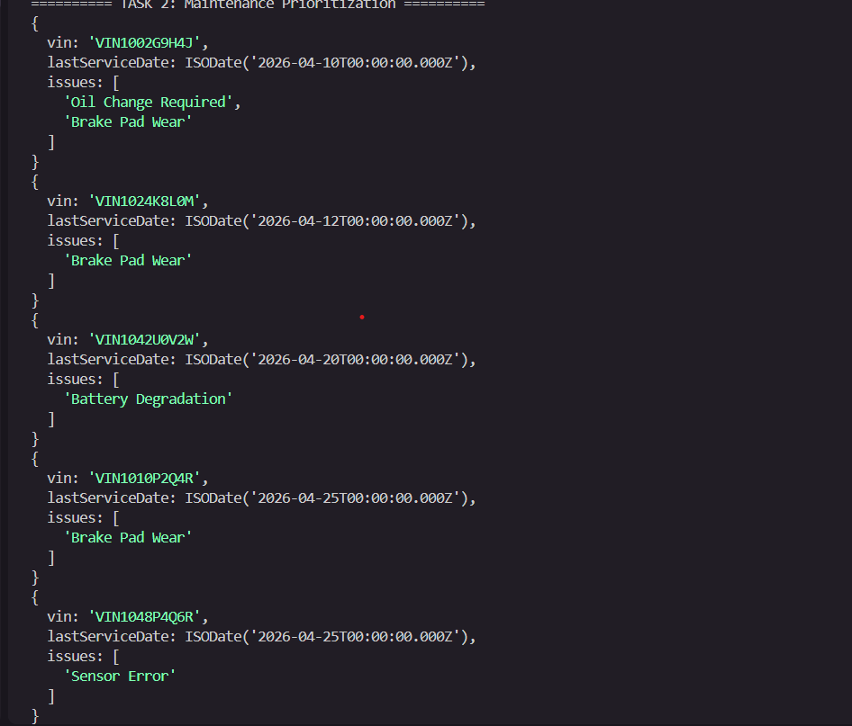
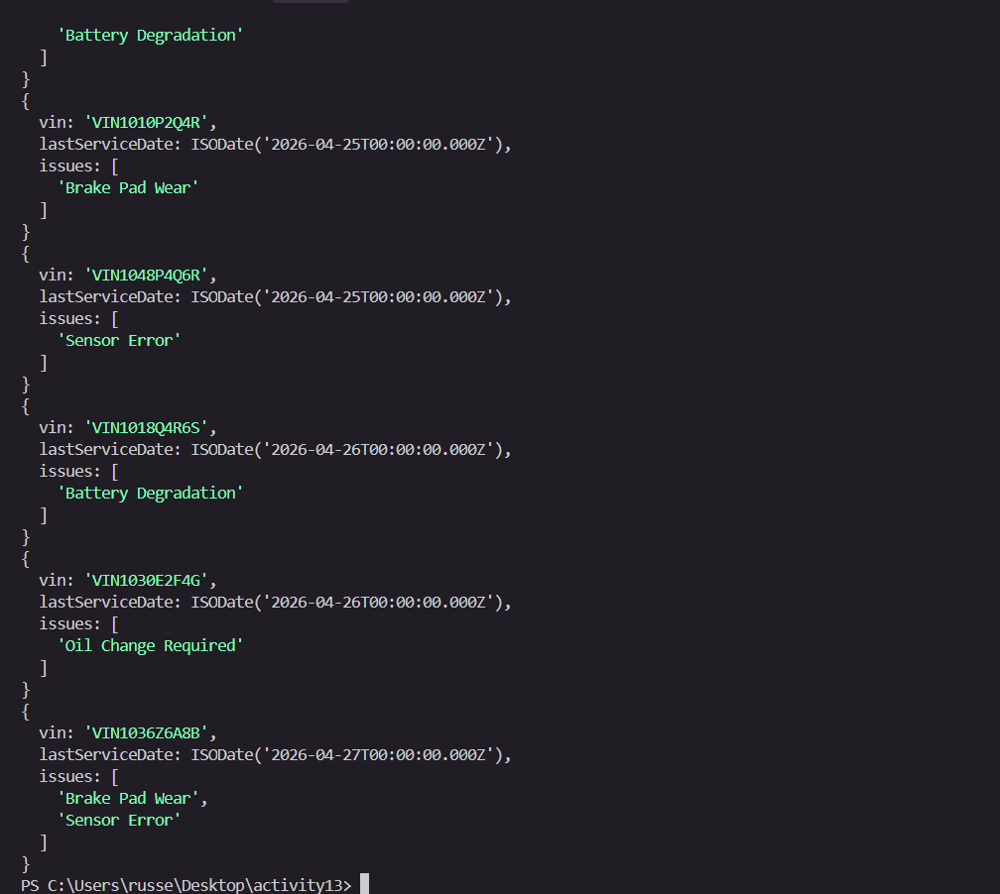
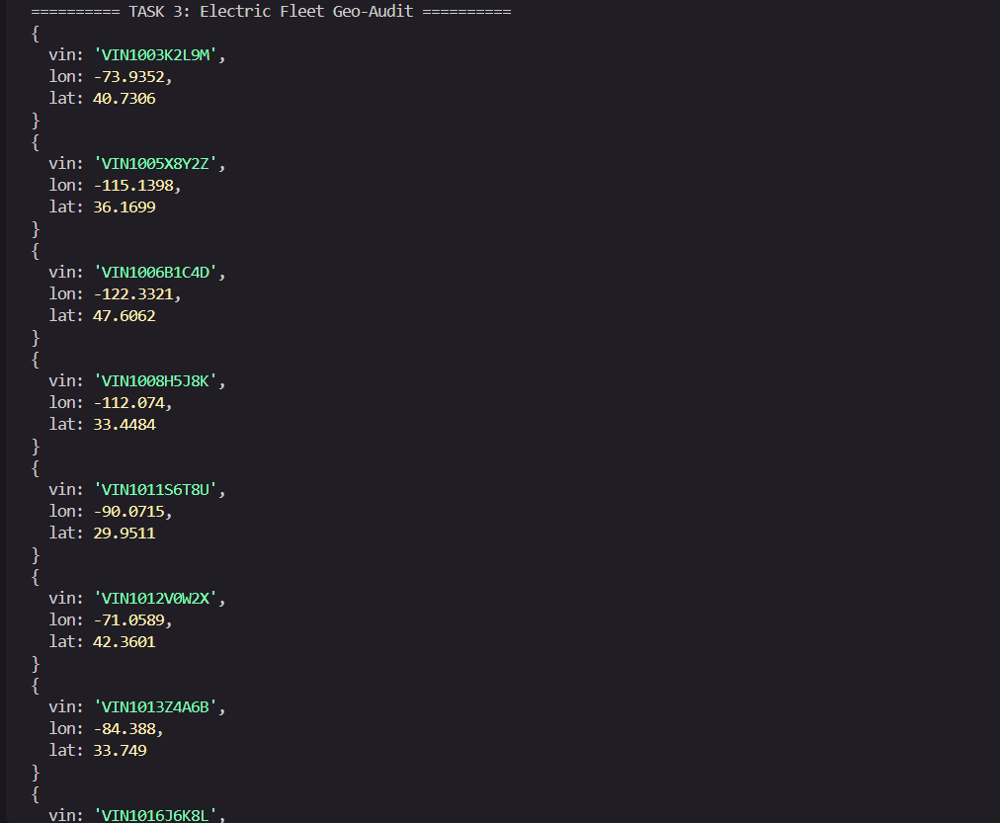
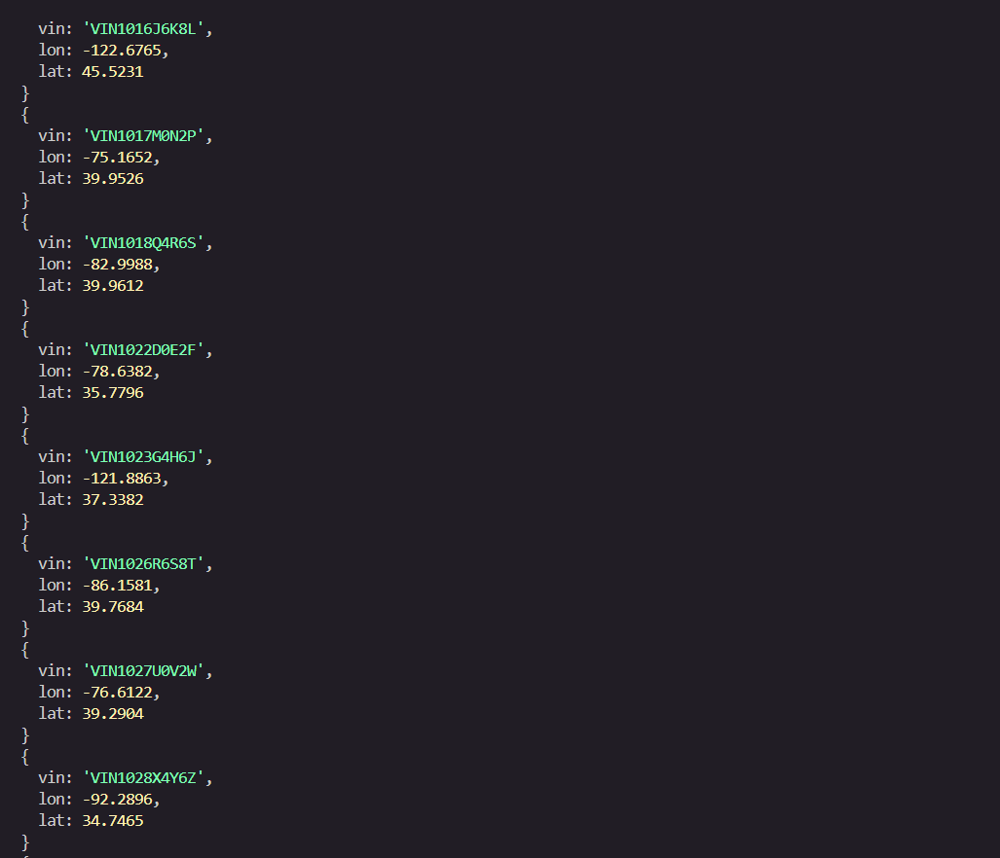
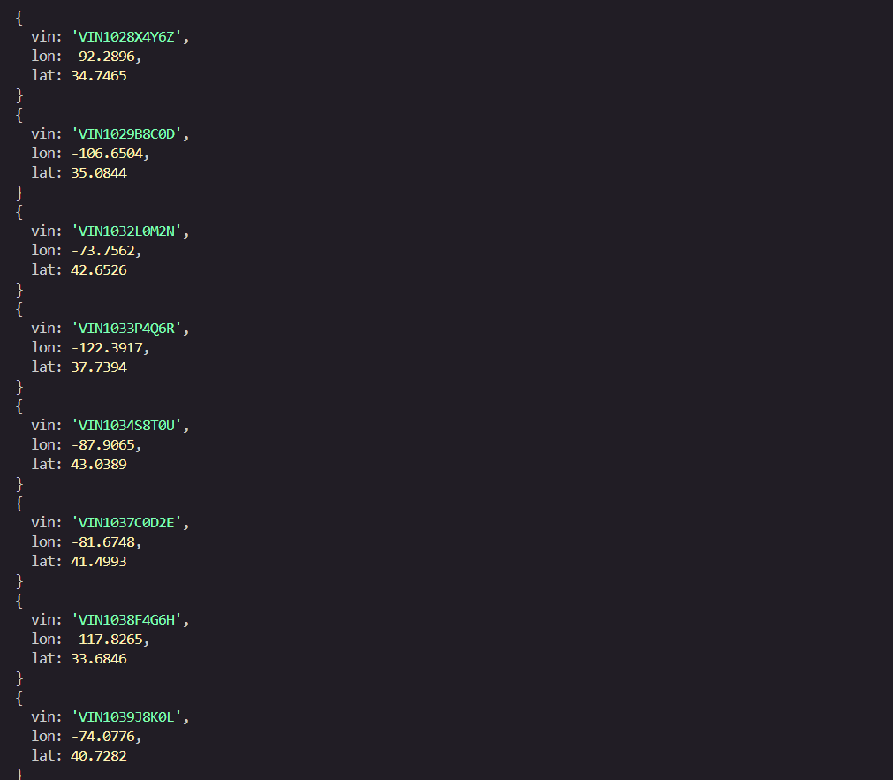
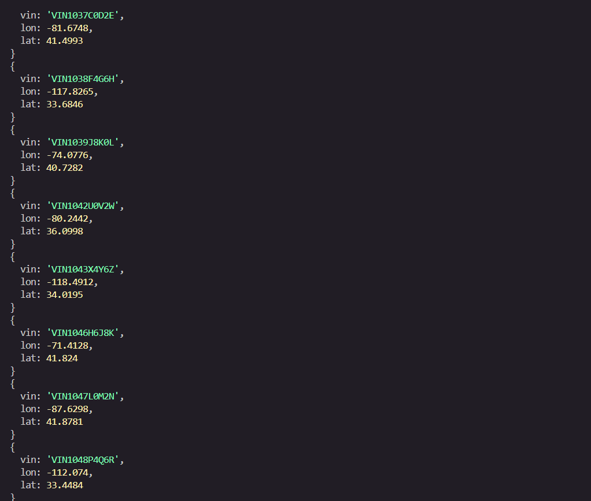
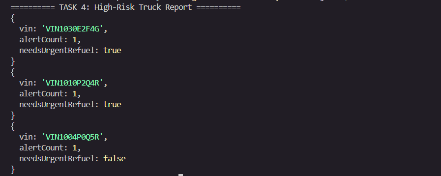

# MongoDB Aggregation Pipeline — Query Output

---

## Task 1: Emergency Fuel Report

**Query:** Vehicles with status `"In Transit"` and `fuelLevel < 50`.

---

## Task 2: Maintenance Prioritization

**Query:** Vehicles in `"Maintenance"`, sorted by `lastServiceDate` ascending. `activeAlerts` renamed to `issues`.

---

## Task 3: Electric Fleet Geo-Audit

**Query:** All electric vehicles with extracted `lon` and `lat` from `location.coordinates`.

---

## Task 4: High-Risk Truck Report

**Query:** Top 3 Semi-Trucks by `alertCount` descending, with computed `needsUrgentRefuel` boolean.

