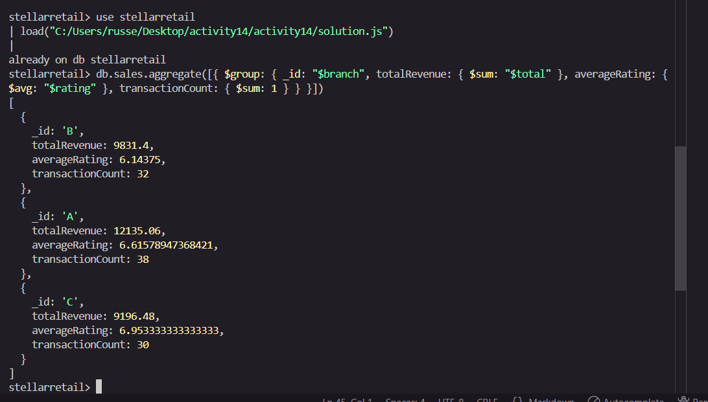
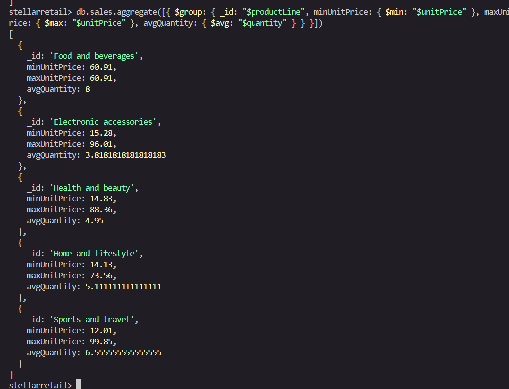
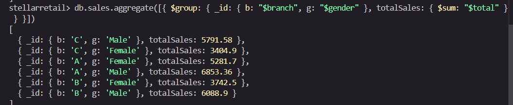
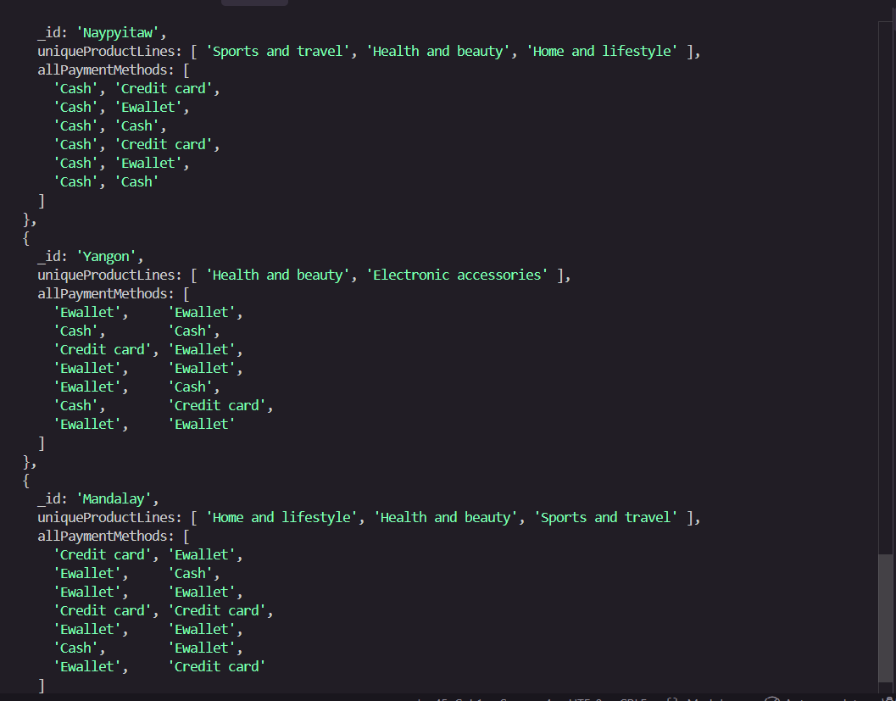
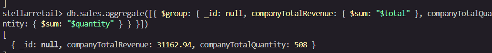

# Lab Activity 14 – Output Screenshots

## Task 1: Branch Performance Summary

> Query: Group by `branch` → `totalRevenue`, `averageRating`, `transactionCount`

---

## Task 2: Product Line Insights (Min/Max/Avg)

> Query: Group by `productLine` → `minUnitPrice`, `maxUnitPrice`, `avgQuantity`

---

## Task 3: Demographic & Branch Analysis (Multiple Fields)

> Query: Group by `{ b: "$branch", g: "$gender" }` → `totalSales`

---

## Task 4: Loyalty Program Deep Dive (Push / AddToSet)

> Query: `$match` Members only → Group by `city` → `uniqueProductLines` (addToSet), `allPaymentMethods` (push)

---

## Task 5: Global Company Totals

> Query: Group all (`_id: null`) → `companyTotalRevenue`, `companyTotalQuantity`

