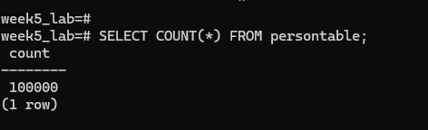
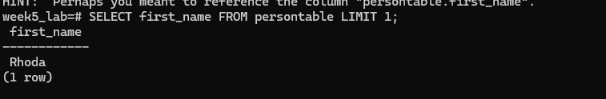
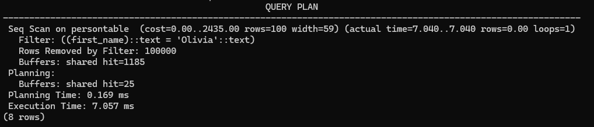
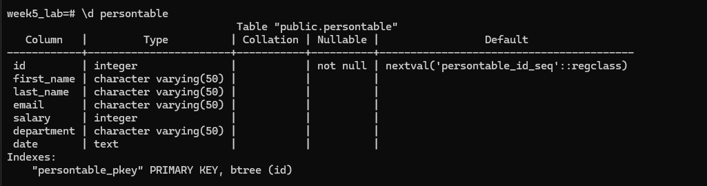
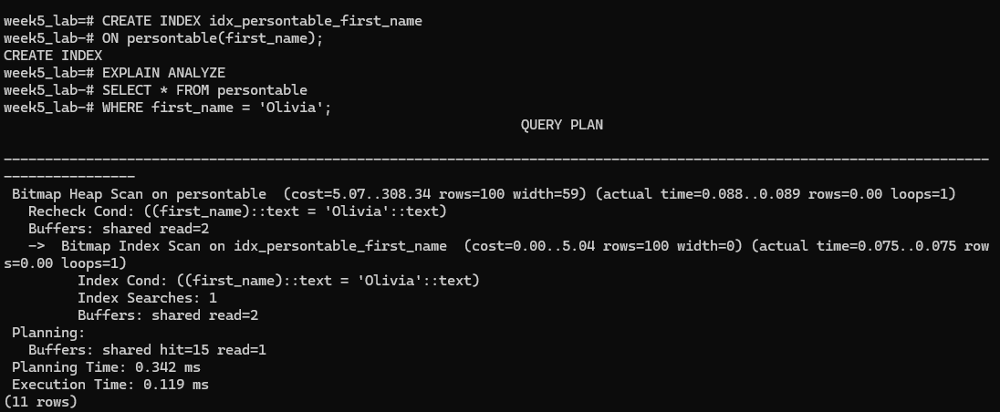
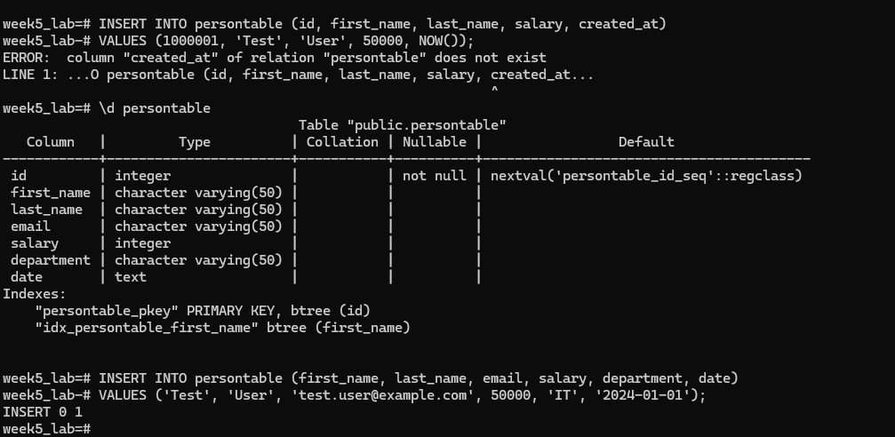

# Week 5 – Database Index Performance Lab
Name: IGNACIO RUSSELL ROY
Course: BSIT-2

## Analysis Measurements

- Initial Data Insertion Time (1,000,000 rows): XX seconds
- Query Execution Time (Non-Indexed): ~7.06 ms
- Query Execution Time (Indexed): ~0.12 ms
- Single Row Insertion Time (With Index): ~X ms

## Analysis Questions

**How did the query execution time change after creating the index?**  
The query execution time decreased significantly after creating the index, dropping from approximately 7 ms using a sequential scan to about 0.12 ms using an index-based scan.

**Why did the query performance change?**  
Without an index, PostgreSQL scanned every row in the table. After creating the index, PostgreSQL used a bitmap index scan to locate matching rows, reducing the number of rows examined.

**What is the trade-off of having an index?**  
Indexes improve read performance but slow down write operations because the index must be updated on every insert, and they also consume additional storage space.

