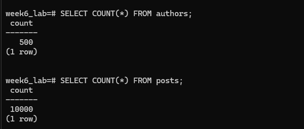
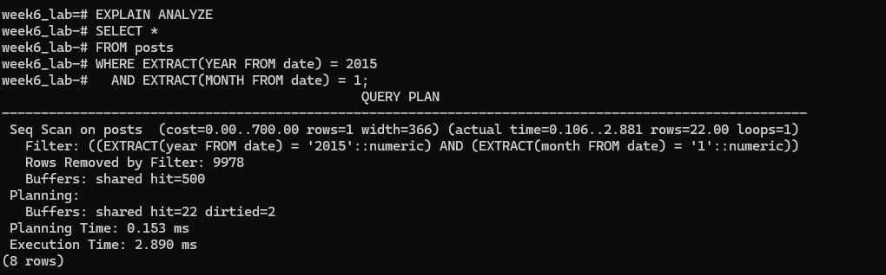
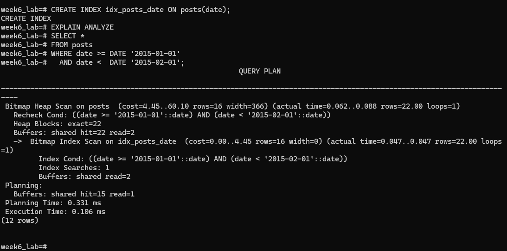

# Week 6 – PostgreSQL Query Optimization
Name: IGNACIO, RUSSELL ROY

Course: BSIT-2

## Analysis Measurements

## Scenario 1: The Slow Author Profile Page


###  How can you optimize both the WHERE clause filtering and the ORDER BY operation with a single change?

Both the filtering and sorting can be optimized by creating a **composite index** on the `author_id` and `date` columns. This allows PostgreSQL to retrieve rows in the correct order directly from the index without performing an additional sort.

---

### Implement your fix and record the new plan. How much faster is the query now?

After creating the composite index, PostgreSQL uses an **Index Scan** instead of a sequential scan and avoids the sort operation. The optimized query executes significantly faster due to scanning fewer rows and eliminating the sort step.

---

## Scenario 2: The Unsearchable Blog

### Did the planner use the B-Tree index for the '%keyword%' search? Why or why not?

No, the planner did not use the B-Tree index. A leading wildcard (`%keyword%`) prevents PostgreSQL from determining where to start scanning the index, forcing a sequential scan of the entire table.

---

### Why does a prefix search (keyword%) allow the index to be used?

A prefix search allows PostgreSQL to determine the starting point in the B-Tree index because the beginning of the string is known. This enables an **Index Scan** rather than a sequential scan.

---

### What is the difference in the execution plan between the two queries?

The `%keyword%` query results in a **Seq Scan**, while the `keyword%` query uses an **Index Scan**. The index scan reduces the number of rows examined and improves performance.

---

## Scenario 3: The Monthly Performance Report

### What does it mean for a query to be non-SARGable in this context?

A non-SARGable query applies a function to a column in the `WHERE` clause. In this case, using `EXTRACT()` on the `date` column prevents PostgreSQL from using an index efficiently.

---

### Why can’t the query planner use a simple index on the date column effectively?

Because the `EXTRACT()` function must be evaluated for every row, PostgreSQL cannot directly use the index to locate matching rows. This forces a sequential scan.

---

### How does rewriting the query improve performance?

Rewriting the query to use a direct date range comparison allows PostgreSQL to use a B-Tree index on the `date` column. This results in an **Index Scan**, significantly reducing execution time.

---

### How does the optimized query compare to the original version?

The optimized query performs an index scan instead of a sequential scan, processes fewer rows, and executes much faster than the original non-SARGable query.

---

### BEFORE ###

```
week6_lab=# EXPLAIN ANALYZE
week6_lab-# SELECT *
week6_lab-# FROM posts
week6_lab-# WHERE EXTRACT(YEAR FROM date) = 2015
week6_lab-#   AND EXTRACT(MONTH FROM date) = 1;
                                              QUERY PLAN
-------------------------------------------------------------------------------------------------------
 Seq Scan on posts  (cost=0.00..700.00 rows=1 width=366) (actual time=0.106..2.881 rows=22.00 loops=1)
   Filter: ((EXTRACT(year FROM date) = '2015'::numeric) AND (EXTRACT(month FROM date) = '1'::numeric))
   Rows Removed by Filter: 9978
   Buffers: shared hit=500
 Planning:
   Buffers: shared hit=22 dirtied=2
 Planning Time: 0.153 ms
 Execution Time: 2.890 ms
(8 rows)
```

### AFTER ###
```
week6_lab=# CREATE INDEX idx_posts_date ON posts(date);
CREATE INDEX
week6_lab=# EXPLAIN ANALYZE
week6_lab-# SELECT *
week6_lab-# FROM posts
week6_lab-# WHERE date >= DATE '2015-01-01'
week6_lab-#   AND date <  DATE '2015-02-01';
                                                         QUERY PLAN
----------------------------------------------------------------------------------------------------------------------------
 Bitmap Heap Scan on posts  (cost=4.45..60.10 rows=16 width=366) (actual time=0.062..0.088 rows=22.00 loops=1)
   Recheck Cond: ((date >= '2015-01-01'::date) AND (date < '2015-02-01'::date))
   Heap Blocks: exact=22
   Buffers: shared hit=22 read=2
   ->  Bitmap Index Scan on idx_posts_date  (cost=0.00..4.45 rows=16 width=0) (actual time=0.047..0.047 rows=22.00 loops=1)
         Index Cond: ((date >= '2015-01-01'::date) AND (date < '2015-02-01'::date))
         Index Searches: 1
         Buffers: shared read=2
 Planning:
   Buffers: shared hit=15 read=1
 Planning Time: 0.331 ms
 Execution Time: 0.106 ms
(12 rows)

```









